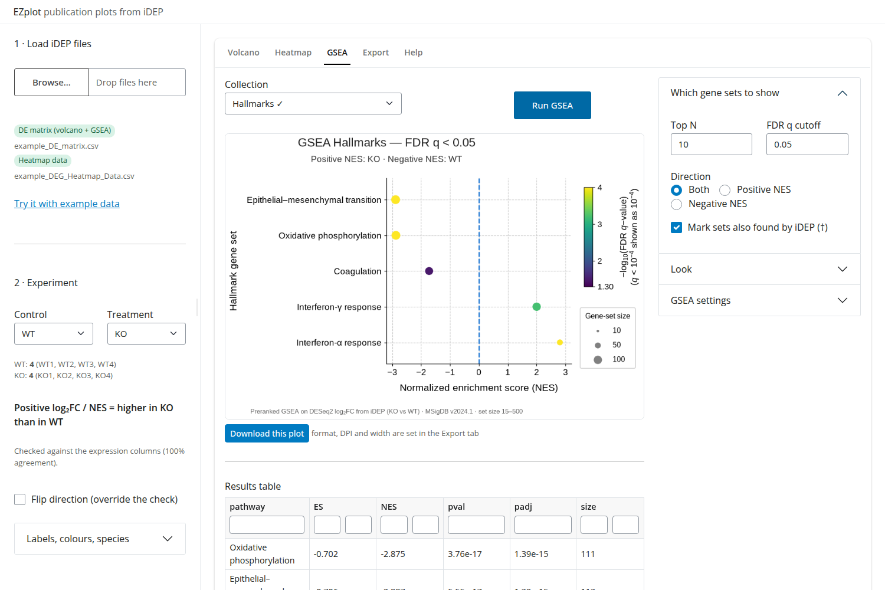

# EZplot

Publication-quality **volcano plots, DEG heatmaps and GSEA dot plots** from
[iDEP](http://bioinformatics.sdstate.edu/idep/) results, in a few clicks.



- Drop in the files you downloaded from iDEP; EZplot recognises each one.
- It checks the direction of your comparison against the sample data, so "up" really means up.
- Re-runs GSEA to give real **NES** values (iDEP's export labels raw ES as "NES").
- Exports PNG/TIFF at journal resolution and column width, or PDF/SVG with editable text.
- Runs on Windows, macOS and Linux. No Docker, no admin rights, no R.

---

## Install and run

You need an internet connection the first time only.

### Windows
1. Download the [latest release](../../releases/latest) (`EZplot-x.y.z.zip`) and unzip it.
2. Double-click **`start-windows.bat`**.
   If Windows SmartScreen says "Windows protected your PC", click **More info → Run anyway**.
3. Your browser opens EZplot. Keep the black window open while you work; close it to quit.

### macOS
1. Download the [latest release](../../releases/latest) and unzip it.
2. **Right-click** `start-mac.command` → **Open** → **Open**. (Only the first time; macOS
   blocks double-clicking scripts it hasn't seen before. After that, double-click works.)
3. Your browser opens EZplot. Keep the Terminal window open while you work.

### Linux
1. Download and unzip the release (or `git clone` this repository).
2. Run `./start-linux.sh` (or double-click it and choose *Run*).
3. Your browser opens EZplot.

**The first start takes 1-2 minutes.** It installs [uv](https://docs.astral.sh/uv/), a small
Python manager, into your user folder, then a private copy of Python and EZplot's packages
(about 400 MB in total). Nothing else on your computer is changed. Later starts take a few
seconds.

### No install at all: browser version
The same app also runs entirely inside your web browser: **https://diegoretamal-uch.github.io/EZplot/**
*(available once the repository is published)*. Your files are processed on your own
computer and are never uploaded. The first load takes 15-40 s. GSEA on GO Biological Process
takes about a minute instead of 20 s.

---

## What to download from iDEP

| EZplot needs | Where in iDEP | Used for |
|---|---|---|
| **DE results matrix**: has columns like `CTRL-TRT_log2FC`, `CTRL-TRT_adjPval` and one column per sample | *DEG* tab → download the full results table | Volcano, GSEA |
| **`DEG_Heatmap_Data.csv`** | *DEG* tab → heatmap → download data | Heatmap |
| `sig_pathways*.csv` *(optional)* | *Pathway* tab → download | Marks gene sets iDEP also found (†) |
| a `.gmt` file *(optional)* | MSigDB, Enrichr, your own | Extra gene-set collection |

No data at hand? Click **Try it with example data** in the app. The example is a synthetic
dataset in iDEP's format.

## Using it

1. **Load files** in the sidebar. Each file gets a label saying what EZplot thinks it is.
2. **Experiment.** Check the control and treatment groups, and read the sentence below them,
   e.g. *"Positive log₂FC / NES = higher in KO than in WT"*. Rename groups for the figure
   legends and pick their colours under *Labels, colours, species*.
3. **Volcano / Heatmap / GSEA tabs.** Each shows a live preview with options on the right.
   On the GSEA tab, pick a collection; GSEA runs on its own and results are kept.
4. **Export.** Pick formats, resolution and printed width (single column 89 mm, double column
   183 mm), then use *Download this plot* or **Download all (.zip)**. The zip includes the GSEA
   tables and an `ezplot_parameters.json` that records every setting used.

### Why EZplot checks the direction
iDEP names the log2FC column `A-B`, but the sign does not reliably follow the name: a gene
clearly higher in B can have a strongly negative `A-B_log2FC`. EZplot compares
the log2FC values with the per-sample expression stored in the same file and orients
everything so that positive = higher in the treatment group you picked. Only when the file
has no per-sample columns does EZplot ask which group a positive log2FC refers to.

### About the GSEA
The "NES" column in iDEP's `sig_pathways*.csv` actually contains the raw enrichment score
(ES), and the true NES cannot be recovered from that file. EZplot therefore runs preranked
GSEA itself:

- ranking: DESeq2 log2FC from iDEP's DE matrix (all genes, oriented treatment vs control)
- gene sets: MSigDB v2024.1 Hallmark and GO BP/MF/CC, mouse and human (bundled), or your `.gmt`
- statistics as in fgsea: weighted KS enrichment score, NES against 1000 size-matched
  random gene sets, very small p-values refined by adaptive multilevel splitting, and
  Benjamini-Hochberg FDR.

On real RNA-seq test data EZplot matched `fgsea` with a median |ΔNES| of 0.01 and a log10
p-value correlation of 0.99 or higher. The top-10 pathways were the same 7-10 of 10 per
collection, with the rest differing among sets whose p-values are within Monte Carlo error
of each other. Results are reproducible for a given random seed (*GSEA settings*).

**Methods text you can adapt:** *Gene set enrichment analysis was performed on genes ranked by
DESeq2 log2 fold change (iDEP) using EZplot v0.1, which implements the fgsea preranked
algorithm (1,000 permutations; multilevel splitting for small p-values), with MSigDB v2024.1
Hallmark and Gene Ontology collections (15-500 genes per set). Gene sets with FDR q < 0.05
were considered significant.*

---

## Command line (optional)

Render everything without opening the app, which is handy for reproducing figures:

```bash
uv run ezplot batch --de DE_matrix.csv --heatmap DEG_Heatmap_Data.csv \
    --pathways sig_pathways.csv --control-label Control --treatment-label Treated \
    --collections hallmarks,go_bp --formats png,pdf --dpi 600 --width-mm 183 --out figures/
```

`uv run ezplot batch --help` lists every option.

## Updating

Download the new release and replace the folder. If you cloned with git, run `git pull`.
The launcher picks up the new packages automatically on the next start.

## Troubleshooting

| Problem | Fix |
|---|---|
| Browser didn't open | Open the address printed in the window (e.g. `http://127.0.0.1:8765`). |
| "Unrecognised file" | Make sure it is a CSV/TSV straight from iDEP; the label explains what was expected. |
| A file is labelled "DEG gene list" | That is iDEP's filtered gene list; download the **full results table** instead. |
| Heatmap file not recognised | Use `DEG_Heatmap_Data.csv`: genes in rows, samples in columns. |
| Firewall prompt on Windows | Allow it; EZplot only talks to your own computer (127.0.0.1). |

---

## For developers

```bash
uv sync                    # dev environment (pytest, shinylive, playwright)
uv run ezplot              # run the app
uv run pytest              # tests (bundled synthetic example data)
./web/build.sh             # browser build into site/  (python -m http.server -d site)
uv run python tools/make_example.py   # regenerate the synthetic example data
```

Layout: `ezplot/io.py` (iDEP readers, direction check), `ezplot/gsea/engine.py` (GSEA),
`ezplot/plots/` (one module per figure), `ezplot/project.py` (state shared by app and CLI),
`ezplot/app.py` (Shiny UI), `ezplot/export.py`. CI runs the tests on Windows, macOS and
Linux. Pushing to `main` publishes the browser version to GitHub Pages.

Bundled data: MSigDB gene sets (CC BY 4.0, see `ezplot/genesets/NOTICE.txt`) and Liberation
Sans fonts (SIL OFL 1.1, see `ezplot/fonts/LICENSE-OFL.txt`), which keep figures identical on
every system.
